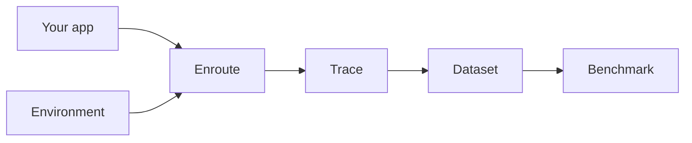

# enroute

**Unified LLM routing with first-class traces, environments, and benchmarks.**

enroute is for builders putting AI into products. Start with an OpenRouter-style multi-provider router. Keep going with the thing OpenRouter does not give you: a single `Trace` object shared by production traffic and RL-style environments — so you can understand prompts, build datasets, run benchmarks, and eventually autoroute to the best model for *your* data.



## Install

```bash
pip install enroute
# optional OpenTelemetry exporter
pip install "enroute[otel]"
```

## Quickstart

Set `ENROUTE_API_KEY`, then use the client like the OpenAI SDK:

```bash
export ENROUTE_API_KEY=enroute-...
```

```python
from enroute import Enroute, Message

client = Enroute()
response = client.chat(
    model="openai/gpt-4o-mini",
    messages=[Message(role="user", content="Hello from enroute")],
    models=["anthropic/claude-sonnet-4"],  # optional fallbacks
)
print(response.text)
client.close()
# Traces → .enroute/traces.jsonl
```

Optional BYOK (pass your own upstream keys explicitly):

```python
import os
from enroute import Enroute

client = Enroute(providers={"openai": os.environ["OPENAI_API_KEY"]})
```

## Four pillars

| Pillar | What you get |
| --- | --- |
| **Router** | Sync/async chat + streaming, fallbacks, retries, cost accounting, model catalog |
| **Tracing** | JSONL / SQLite / OTel sinks, redaction, sampling, late labels, attempt history |
| **Environments** | Tasks + tools + scorers → scored traces (the RL harness) |
| **Benchmarks** | Environment × models → markdown/JSON report with win rates |

## Environments in 30 seconds

```python
from enroute import Environment, TaskData

env = Environment(name="support-triage", version="0.1.0")

@env.tool
def lookup_order(order_id: str) -> dict:
    """Look up an order."""
    return {"status": "shipped"}

@env.scorer(weight=1.0)
def ok(rollout) -> float:
    return 1.0 if "shipped" in (rollout.response.text or "").lower() else 0.0

@env.tasks
def tasks():
    yield TaskData(task_id="1", input="Where is order A?")

rollout = env.rollout(next(env.iter_tasks()), client, model="openai/gpt-4o-mini")
print(rollout.trace.outcome)
```

## Docs

Full documentation: concept pages, guides, and generated API reference.

- Trace schema stability: `schemas/trace.v1.json`
- Routing walkthrough: [`examples/routing/`](examples/routing) (also under docs → Guides)

## Development

```bash
uv sync --group dev --group docs
uv run pytest -m "not live"
uv run ruff check .
uv run mypy src/enroute
uv run mkdocs build --strict
```

## License

Apache-2.0
