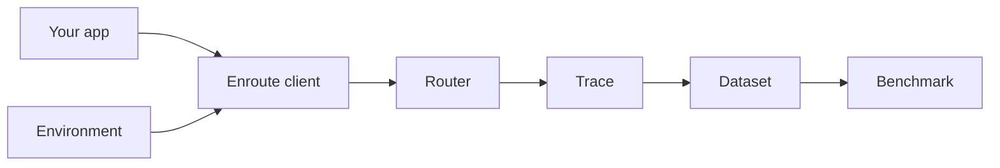

# enroute

**One router. One trace. Environments and benchmarks that speak the same language.**

enroute is a Python package for builders putting AI into products. It gives you:

1. **Unified routing** across model providers (OpenAI, Anthropic, Google, and OpenAI-compatible vendors)
2. **First-class traces** — the same record for production traffic and eval rollouts
3. **Environments** — RL-style harnesses (tasks + tools + scorers) that *generate* those traces
4. **Benchmarks** — run an environment across models and get a scored report



## Why a unified Trace?

If production traffic and eval harnesses emit different shapes, every downstream promise breaks. enroute makes them the same object so you can:

- Understand which prompts succeed
- Build datasets from real traffic
- Train or rank models against your environment
- Eventually autoroute each prompt to the best model for *your* data

## Install

```bash
pip install enroute
# or
uv add enroute
```

## 60-second taste

```bash
export ENROUTE_API_KEY=enroute-...
```

```python
from enroute import Enroute, Message

client = Enroute()
response = client.chat(
    model="openai/gpt-4o-mini",
    messages=[Message(role="user", content="Hello")],
)
print(response.text)
client.close()
# Traces land in .enroute/traces.jsonl by default
```

Optional bring-your-own-key: `Enroute(providers={"openai": "sk-..."})`.

## Next

- [Quickstart](quickstart.md)
- [Routing examples walkthrough](guides/routing-examples.md)
- [What is a Trace?](concepts/trace.md)
- [What is an Environment?](concepts/environment.md)
